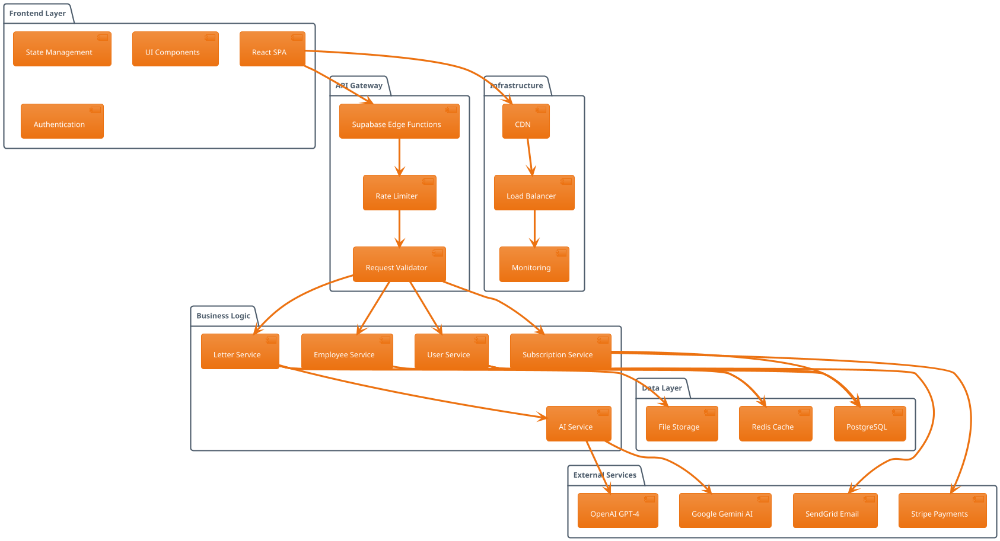
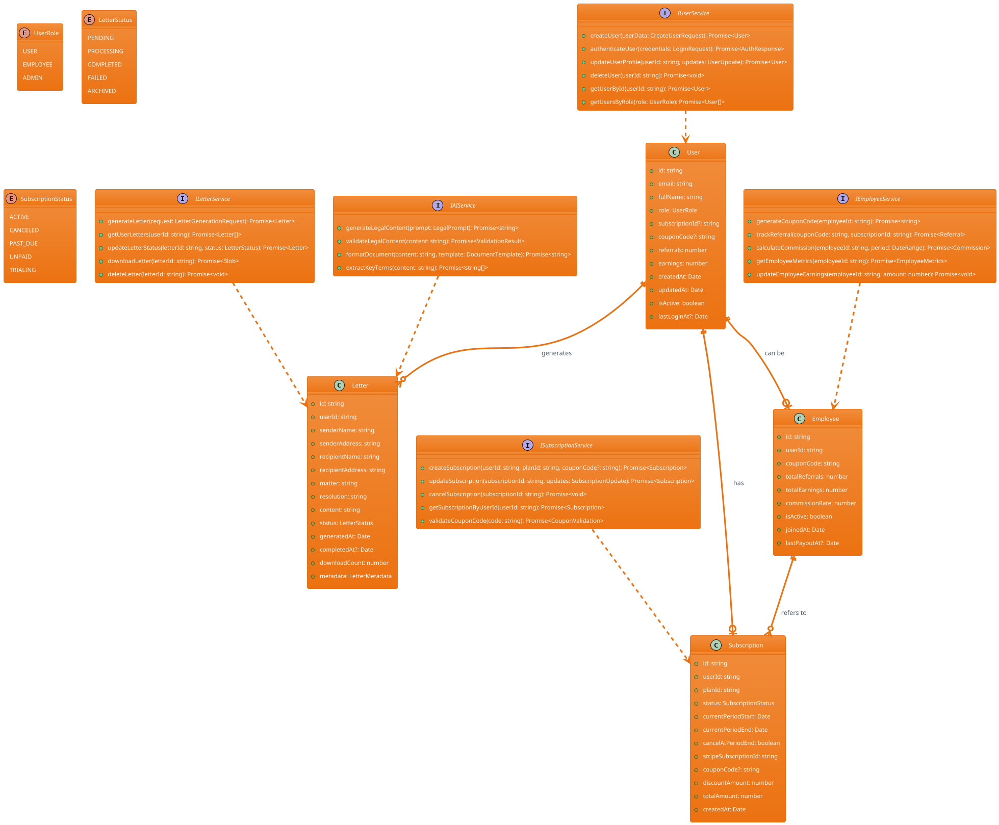
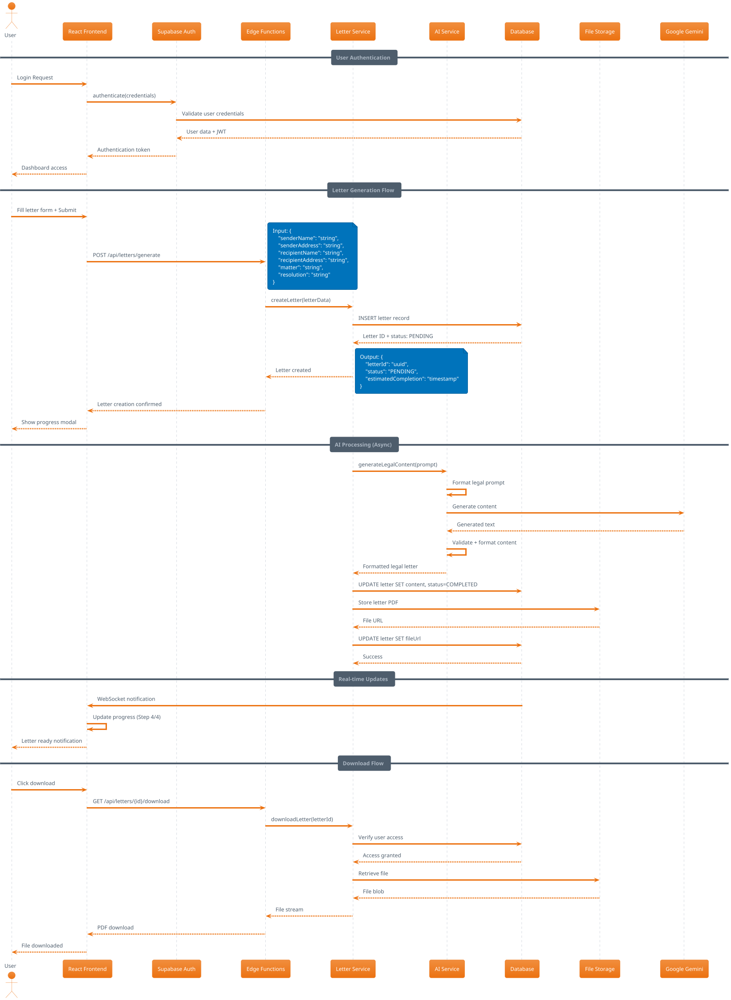
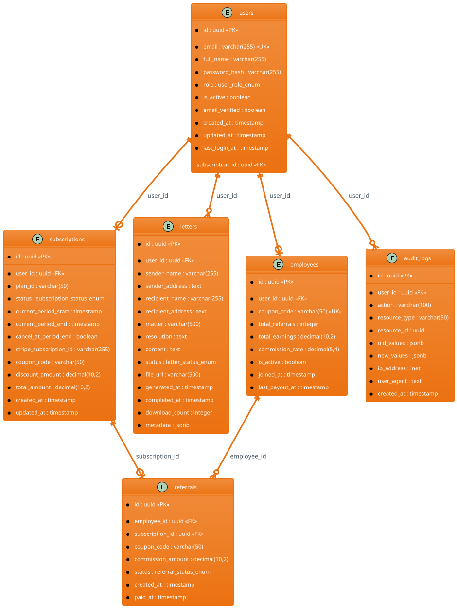

# LegalLetter AI - Elite System Architecture Design

## Executive Summary

LegalLetter AI is a sophisticated SaaS platform that leverages AI to generate professional legal documents with role-based access control, subscription management, and employee referral systems. The architecture follows enterprise-grade patterns with security, scalability, and maintainability as core principles.

## Implementation Approach

### Core Technologies & Framework Selection
1. **Frontend Stack (Elite Tier)**
   - React 18+ with TypeScript for type safety and developer experience
   - Shadcn/ui + Tailwind CSS v4.0 for consistent, accessible design system
   - Vite for lightning-fast development and optimized builds
   - React Query for intelligent data fetching and caching
   - Zustand for predictable state management

2. **Backend Architecture (Production-Ready)**
   - Supabase as Backend-as-a-Service with PostgreSQL
   - Row Level Security (RLS) for data isolation
   - Edge Functions for serverless compute
   - Real-time subscriptions for live updates
   - JWT-based authentication with refresh tokens

3. **AI Integration (Scalable)**
   - Google Gemini AI for legal document generation
   - Fallback to OpenAI GPT-4 for redundancy
   - Rate limiting and quota management
   - Response caching for performance

4. **Security Framework (Enterprise-Grade)**
   - Multi-factor authentication support
   - Role-based access control (RBAC)
   - API rate limiting and DDoS protection
   - Input sanitization and validation
   - Audit logging for compliance

## User & UI Interaction Patterns

### 1. Authentication Flow
- **Multi-step registration** with email verification
- **Role selection** during signup (User/Employee/Admin)
- **Admin secret key** validation for admin accounts
- **Password strength** requirements with real-time feedback
- **Social login** integration (Google, Microsoft)

### 2. User Dashboard Experience
- **Progressive disclosure** of features based on subscription tier
- **Real-time letter status** updates with WebSocket connections
- **Drag-and-drop** file upload for supporting documents
- **Preview mode** with live editing capabilities
- **Bulk operations** for managing multiple letters

### 3. Employee Referral System
- **Gamified dashboard** with achievement badges
- **Social sharing** integration for coupon codes
- **Performance analytics** with interactive charts
- **Leaderboard** with monthly competitions
- **Commission tracking** with detailed breakdowns

### 4. Admin Management Portal
- **Comprehensive analytics** dashboard with KPIs
- **User lifecycle** management and support tools
- **Revenue tracking** with forecasting models
- **System health** monitoring and alerts
- **Compliance reporting** and audit trails

## System Architecture

## Data Structures & Interfaces

## Program Call Flow

## Database ER Diagram

## Security Architecture

### 1. Authentication & Authorization
- **JWT tokens** with 15-minute expiry and refresh token rotation
- **Role-based permissions** with granular access control
- **Multi-factor authentication** for admin accounts
- **Session management** with concurrent login limits

### 2. Data Protection
- **Encryption at rest** using AES-256
- **Encryption in transit** with TLS 1.3
- **PII tokenization** for sensitive user data
- **GDPR compliance** with data retention policies

### 3. API Security
- **Rate limiting** (100 requests/minute per user)
- **Input validation** with schema enforcement
- **SQL injection prevention** with parameterized queries
- **XSS protection** with content security policies

### 4. Infrastructure Security
- **WAF protection** against common attacks
- **DDoS mitigation** with traffic analysis
- **Vulnerability scanning** with automated patching
- **Backup encryption** with 3-2-1 strategy

## Performance Optimization

### 1. Frontend Performance
- **Code splitting** with lazy loading
- **Image optimization** with WebP format
- **Caching strategy** with service workers
- **Bundle analysis** with size monitoring

### 2. Backend Performance
- **Database indexing** on frequently queried columns
- **Connection pooling** with optimal pool sizes
- **Query optimization** with execution plan analysis
- **Caching layers** with Redis for hot data

### 3. Scalability Measures
- **Horizontal scaling** with load balancers
- **Database sharding** by user geography
- **CDN distribution** for global performance
- **Auto-scaling** based on traffic patterns

## Monitoring & Observability

### 1. Application Monitoring
- **Error tracking** with Sentry integration
- **Performance monitoring** with Core Web Vitals
- **User analytics** with privacy-compliant tracking
- **A/B testing** framework for feature rollouts

### 2. Infrastructure Monitoring
- **System metrics** (CPU, memory, disk, network)
- **Database performance** with query analysis
- **API response times** with SLA monitoring
- **Uptime monitoring** with alerting

### 3. Business Metrics
- **User engagement** and retention rates
- **Revenue tracking** and forecasting
- **Conversion funnel** analysis
- **Customer satisfaction** scores

## Deployment Strategy

### 1. CI/CD Pipeline
- **Automated testing** with 90%+ code coverage
- **Security scanning** in build process
- **Blue-green deployment** for zero downtime
- **Rollback capabilities** with one-click revert

### 2. Environment Management
- **Development** environment for feature development
- **Staging** environment for integration testing
- **Production** environment with high availability
- **Disaster recovery** with RTO < 4 hours

## Compliance & Legal

### 1. Data Privacy
- **GDPR compliance** with data subject rights
- **CCPA compliance** for California users
- **Data processing agreements** with vendors
- **Privacy by design** principles

### 2. Legal Document Generation
- **Disclaimer requirements** for AI-generated content
- **Professional liability** considerations
- **Jurisdiction-specific** legal formatting
- **Attorney review** workflow integration

## Future Enhancements

### 1. Advanced AI Features
- **Multi-language support** for international users
- **Legal precedent** integration and citation
- **Document templates** for common legal scenarios
- **AI-powered** legal advice recommendations

### 2. Enterprise Features
- **White-label solutions** for law firms
- **API access** for third-party integrations
- **Bulk processing** for enterprise clients
- **Custom branding** and domain options

### 3. Mobile Applications
- **Native iOS/Android** apps with offline capabilities
- **Push notifications** for letter status updates
- **Mobile-optimized** document editing
- **Biometric authentication** for enhanced security

## Unclear Aspects & Assumptions

### 1. Legal Compliance Requirements
- **Jurisdiction-specific** legal formatting requirements need clarification
- **Professional liability** insurance requirements for AI-generated legal documents
- **Attorney supervision** requirements vary by jurisdiction

### 2. Scalability Assumptions
- **User growth** projections assume 10x growth within 12 months
- **Geographic expansion** timeline affects infrastructure decisions
- **Feature complexity** may require architecture adjustments

### 3. Integration Requirements
- **Third-party legal databases** integration scope needs definition
- **CRM system** integration requirements for enterprise clients
- **Accounting software** integration for automated billing

This architecture provides a solid foundation for a scalable, secure, and maintainable LegalLetter AI platform that can grow with business requirements while maintaining elite-level quality and performance standards.